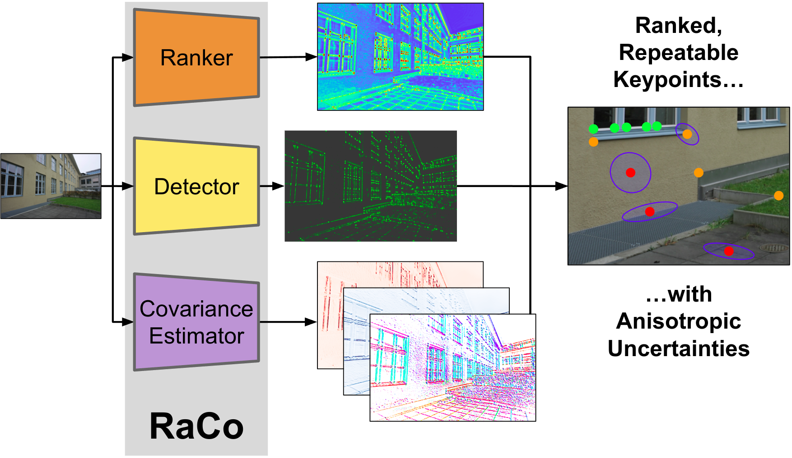
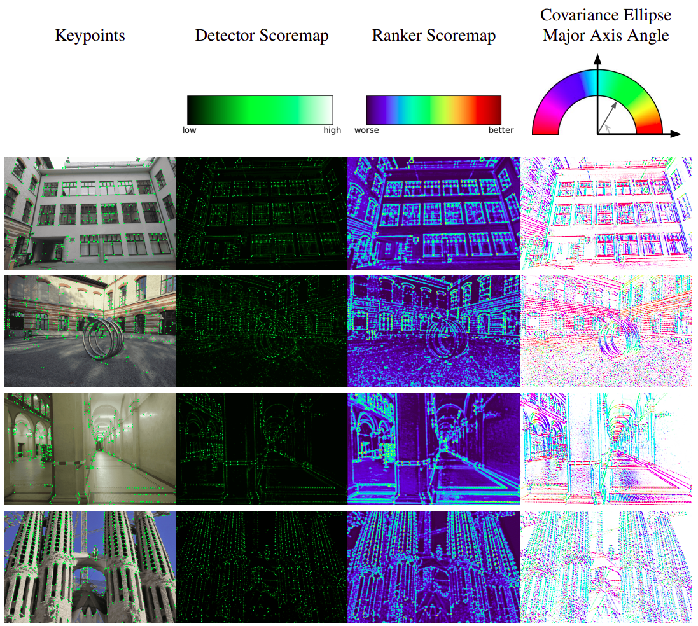
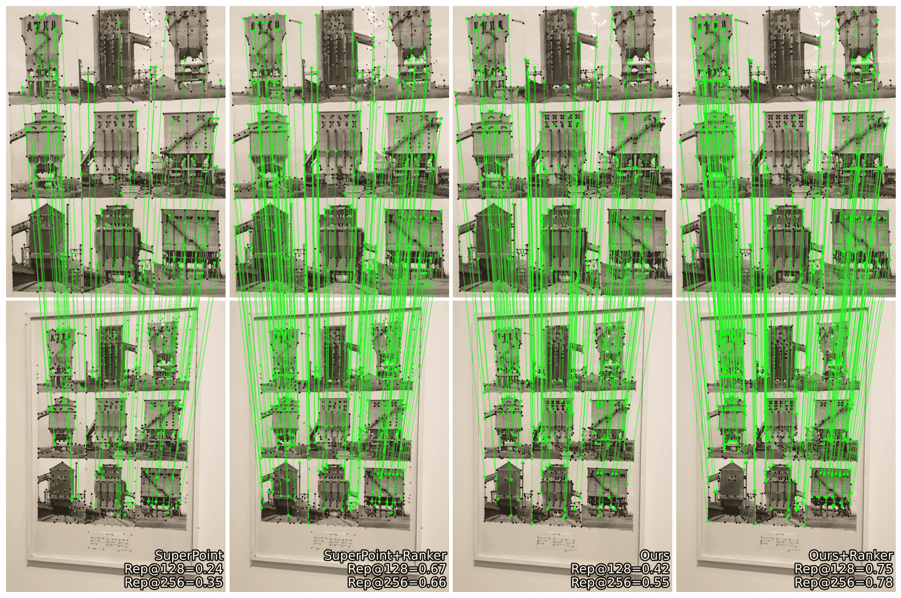
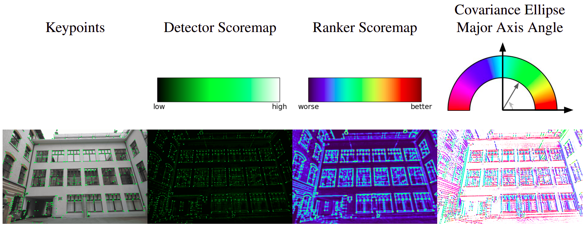

<p align="center">
  <h1 align="center">RaCo: Ranking and Covariance for Practical Learned Keypoints</h1>
  <p align="center">
    <a href="https://www.linkedin.com/in/abhiramshenoi/">Abhiram Shenoi</a>
    ·
    <a href="https://www.linkedin.com/in/philipplindenberger/">Philipp Lindenberger</a>
    ·
    <a href="https://psarlin.com/">Paul-Edouard&nbsp;Sarlin</a>
    ·
    <a href="https://www.microsoft.com/en-us/research/people/mapoll/">Marc&nbsp;Pollefeys</a>
  </p>
  <h2 align="center">
    <p>3DV 2025</p>
    <a href="https://arxiv.org/pdf/x" align="center">Paper</a> | 
    <a href="demo.ipynb" align="center">Demo</a>
  </h2>
</p>

## Abstract

We introduce **RaCo**, a lightweight neural network designed to learn robust and versatile keypoints suitable for a variety of 3D computer vision tasks. The model integrates three key components: the repeatable keypoint detector, a differentiable ranker to maximize matches with a limited number of keypoints, and a covariance estimator to quantify spatial uncertainty in metric scale.

Trained on perspective image crops only, RaCo operates without the need for covisible image pairs. It achieves strong rotational robustness through extensive data augmentation, even without the use of computationally expensive equivariant network architectures. The method is evaluated on several challenging datasets, where it demonstrates state-of-the-art performance in keypoint repeatability and two-view matching, particularly under large in-plane rotations.

Ultimately, RaCo provides an effective and simple strategy to independently estimate keypoint ranking and metric covariance without additional labels, detecting interpretable and repeatable interest points.

<p align="center">
  
</p>


## Features

RaCo is a rotationally equivariant keypoint detector that identifies stable and repeatable keypoints in images. Refer the paper for a quantiative evaluation of its rotational equivariance.


<div align="center">
  <video src="https://github.com/user-attachments/assets/a41394b5-b2d3-4341-a036-afc0fa2eb6e0">
</div>

<details>
<summary>RaCo's Outputs (click to expand)</summary>
RaCo outputs the following for each input image:

- **Keypoints**: 2D coordinates of detected keypoints in pixel space.
- **Keypoint Scores**: Detection confidence scores for each keypoint.
- **Ranker Scores**: Ranking scores for each keypoint indicating their reliability for matching. To subsample keypoints based on ranking, select the top-k keypoints with the highest ranker scores.
- **Covariances**: 2x2 covariance matrices representing the uncertainty of each keypoint's location.

<p align="center">
  
</p>
</details>

<details>
<summary>Keypoint Ranking (click to expand)</summary>
The ranking module is trained to produce a ranking score for each keypoint, which is consistent across different viewpoints and image transformations. The ranking score is more reliable than the detection score for selecting keypoints for matching as it is trained to maintain a consistent order of keypoints across images.

Here the repeatability of keypoints selected based on ranking scores is shown to be higher than those selected based on detection scores. Refer the paper for a quantiative evaluation of the ranking module.

<p align="center">
  
</p>
</details>

<details>
<summary>Covariance Estimation (click to expand)</summary>
The covariance estimator predicts the uncertainty of keypoint locations in 2D pixel space. This is useful for applications that require a measure of confidence in keypoint detections.

<p align="center">
  
</p>
</details>

## Installation

### From source

```bash
git clone https://github.com/cvg/RaCo.git
cd RaCo
pip install -e .
```

## Quick Start

```python
import torch
from raco import RaCo
from raco.utils import load_image

# Load an image
device = "cuda" if torch.cuda.is_available() else "cpu"
image = load_image("assets/i_castle.png")

# Initialize a RaCo extractor with the default configuration
extractor = RaCo()

# Extract keypoints
output = extractor.extract(image)
print("Output keys:", [k for k in output.keys()])

# Access results
keypoints = output["keypoints"]  # (B, N, 2) - keypoint coordinates
scores = output["keypoint_scores"]  # (B, N) - detection confidence
ranker_scores = output["ranker_scores"]  # (B, N) - ranking scores
covariances = output["covariances"]  # (B, N, 2, 2) - uncertainty estimates
```

## Demo

Check out the [`demo.ipynb`](demo.ipynb) notebook for a complete walkthrough showing:

- Basic keypoint extraction
- Visualization of detected keypoints
- Uncertainty estimation with covariance ellipses
- Visualization of the ranking of keypoints

## Advanced configuration

<details>
<summary>Details of all parameters (click to expand)</summary>

- `weights`: Path or URL to pretrained weights. Can be a local file path (e.g., `"raco/raco.pth"`) or a URL (e.g., `"https://github.com/cvg/RaCo/releases/download/v1.0.0/raco.pth"`). Set to `None` to skip loading pretrained weights. Default: `"raco/raco.pth"`.
- `max_num_keypoints`: Maximum number of keypoints to extract per image. Default: 512.
- `nms_radius`: Radius for non-maximum suppression (must be odd). Larger values result in more spread out keypoints. Default: 3.
- `subpixel_sampling`: Enable subpixel refinement of keypoint locations for higher accuracy. Default: True.
- `subpixel_temp`: Temperature parameter for subpixel refinement softmax. Lower values make the refinement more focused. Default: 0.5.
- `detection_threshold`: Minimum keypoint score threshold. Keypoints with keypoint scores below this value are filtered out. Set to -1 to disable filtering. Default: -1 (disabled).
- `ranker`: Enable the ranking module to predict the ranker scores. Default: True.
- `covariance_estimator`: Enable covariance prediction for 2D spatial keypoint uncertainty estimation. Default: True.

</details>

## Citation

If you use RaCo in your research, please cite:

```bibtex
@inproceedings{shenoi2025raco,
  title={{RaCo}: Ranking and Covariance for Practical Learned Keypoints},
  author={Shenoi, Abhiram and Lindenberger, Philipp and Sarlin, Paul-Edouard and Pollefeys, Marc},
  booktitle={International Conference on 3D Vision},
  year={2025},
  url={https://openreview.net/forum?id=BWtdgrdcBH}
}
```

## License

This project is licensed under the Apache License 2.0 see the [LICENSE](LICENSE) file for details.

